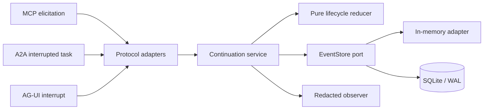

# PauseMesh

Protocol-neutral, crash-safe `pause -> handoff -> resume` primitives for agent workflows.

PauseMesh is a small TypeScript library and local reference server for a lifecycle gap between
[MCP elicitation](https://modelcontextprotocol.io/specification/2025-11-25/client/elicitation),
[A2A interrupted tasks](https://github.com/a2aproject/A2A/blob/main/docs/specification.md), and
[AG-UI interrupts](https://github.com/ag-ui-protocol/ag-ui). It persists one canonical
continuation, projects it at the protocol boundary, and allows exactly one authenticated resume.

It is **not** an agent framework, model router, tool executor, workflow DAG, memory system, or
generic gateway.

## Why this exists

The three protocols solve different layers of the stack:

- MCP lets a server elicit user input while a tool or task is active.
- A2A represents `TASK_STATE_INPUT_REQUIRED` and `TASK_STATE_AUTH_REQUIRED` task interruptions.
- AG-UI represents frontend-facing interrupts and resume entries.

Each can pause a run, but a real deployment must also survive a disconnected browser, process
restart, retry, or callback reaching another replica. The open AG-UI discussion on
[MCP elicitation](https://github.com/ag-ui-protocol/ag-ui/issues/231) identifies this durable
pending-state problem directly. PauseMesh isolates that problem instead of introducing another
orchestrator.

## Guarantees in the MVP

- Append-only, versioned lifecycle: `pending -> resumed | cancelled | expired`.
- Atomic compare-and-swap fencing on every event append.
- Opaque resume token returned once; only its SHA-256 hash is persisted.
- A continuation can resume once. Concurrent attempts produce one winner.
- Exact retries use an independent idempotency key and return the first outcome.
- SQLite/WAL recovery after process restart, behind a replaceable `EventStore` port.
- Redacted observations that never include tokens or continuation payloads.
- Versioned, intentionally narrow MCP 2025-11-25, A2A 1.0, and AG-UI projections.

## Architecture



Dependencies point inward. Domain code imports no Hono, SQLite, protocol SDK, or logger package.
Protocol drift stays in adapters; storage replacement stays behind one atomic append contract.

## Quick start

Requirements: Node.js 24+ and pnpm 11.

```bash
pnpm install --frozen-lockfile
pnpm check
pnpm demo
```

Start the local reference API:

```bash
cp .env.example .env
pnpm build
PAUSEMESH_DATABASE_PATH=./data/pausemesh.db pnpm start
```

Create a continuation:

```bash
curl -sS http://127.0.0.1:8787/v1/continuations \
  -H 'content-type: application/json' \
  -d '{
    "correlationId": "agent-thread-42",
    "payload": {
      "kind": "input",
      "message": "Choose the data residency region",
      "responseSchema": {
        "type": "object",
        "properties": {"region": {"type": "string"}},
        "required": ["region"]
      }
    }
  }'
```

The response contains `continuation` and a one-time `resumeToken`. Persist the continuation ID in
your workflow checkpoint; keep the raw token in the authorized caller, not in logs or metadata.

Project the pending continuation to a protocol surface:

```bash
curl -sS http://127.0.0.1:8787/v1/continuations/CONTINUATION_ID/projections/ag-ui
curl -sS http://127.0.0.1:8787/v1/continuations/CONTINUATION_ID/projections/a2a
curl -sS http://127.0.0.1:8787/v1/continuations/CONTINUATION_ID/projections/mcp
```

Resume once:

```bash
curl -sS -X POST \
  http://127.0.0.1:8787/v1/continuations/CONTINUATION_ID/resume \
  -H 'content-type: application/json' \
  -H 'idempotency-key: callback-0001' \
  -H 'authorization: PauseMesh RESUME_TOKEN' \
  -d '{"payload":{"region":"eu"}}'
```

Repeating the exact request returns the stored result. A different payload with the same
idempotency key is rejected, as is any later attempt to reuse the consumed continuation.

## Library use

```ts
import {
  ContinuationService,
  Sha256TokenIssuer,
  SqliteEventStore,
  SystemClock,
  NoopObserver,
} from "pausemesh";

const store = new SqliteEventStore("./data/pausemesh.db");
const continuations = new ContinuationService({
  clock: new SystemClock(),
  eventStore: store,
  observer: new NoopObserver(),
  tokenIssuer: new Sha256TokenIssuer(),
  tokenTtlSeconds: 900,
});
```

## Repository map

```text
src/domain/                 versioned events, envelope, reducer, typed errors
src/application/            lifecycle use cases and concurrency resolution
src/ports/                  EventStore, Clock, TokenIssuer, Observer
src/adapters/storage/       in-memory and SQLite/WAL stores
src/adapters/{mcp,a2a,agui} protocol projections
src/adapters/http/          local Hono reference API
tests/                      domain, storage, concurrency, adapter, HTTP, config tests
docs/                       delivery contract and architecture decisions
```

## Security and production boundary

The local HTTP server deliberately has no user identity, tenant authorization, TLS termination,
rate limiter, or encrypted payload store. Bind it to loopback for evaluation. A production host
must authenticate every inspect/resume/cancel operation, scope continuation IDs to the caller,
protect payload data at rest, terminate TLS, and retain the same one-shot/CAS invariants.

Resume tokens are bearer credentials. PauseMesh hashes them before persistence and redacts them
from its observer, but the caller is responsible for safe delivery and storage. A SHA-256 hash is
appropriate here because tokens are generated with 256 bits of entropy; it is not being used to
hash human passwords or API keys.

## Status

`0.1.0` is an experimental reference MVP. The canonical state machine and storage contract are
stable enough to test; protocol adapters are expected to evolve as upstream specifications do.
See [the delivery contract](docs/delivery-contract.md) for acceptance evidence and explicit
non-goals.

Apache-2.0 © 2026 Antonio Antenore.
