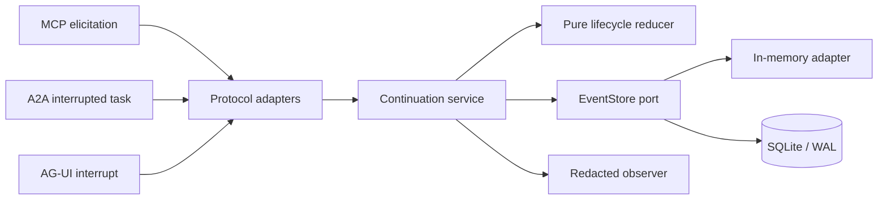

# PauseMesh

Protocol-neutral, crash-safe `pause -> handoff -> resume` primitives for agent workflows.

PauseMesh is a small TypeScript library and local reference server for a lifecycle gap between
[MCP elicitation](https://modelcontextprotocol.io/specification/2025-11-25/client/elicitation),
[A2A interrupted tasks](https://a2a-protocol.org/v1.0.0/specification/), and
[AG-UI interrupts](https://docs.ag-ui.com/concepts/interrupts). It persists one canonical
continuation, projects it at the protocol boundary, and allows exactly one authenticated resume.

It is **not** an agent framework, model router, tool executor, workflow DAG, memory system, or
generic gateway.

## Why this exists

The three protocols solve different layers of the stack:

- MCP lets a server elicit user input while a tool or task is active.
- A2A represents `TASK_STATE_INPUT_REQUIRED` and `TASK_STATE_AUTH_REQUIRED` task interruptions.
- AG-UI represents frontend-facing interrupts and resume entries.

Each can pause a run, but a real deployment must also survive a disconnected browser, process
restart, retry, or callback reaching another replica. The open AG-UI discussion on
[MCP elicitation](https://github.com/ag-ui-protocol/ag-ui/issues/231) identifies this durable
pending-state problem directly. PauseMesh isolates that problem instead of introducing another
orchestrator.

## Guarantees in the MVP

- Append-only, versioned lifecycle: `pending -> resumed | cancelled | expired`.
- Atomic compare-and-swap fencing on every event append.
- Opaque resume token returned once; only its SHA-256 hash is persisted.
- A continuation can resume once. Concurrent attempts produce one winner.
- Exact retries use an independent idempotency key and return the first outcome.
- SQLite/WAL recovery after process restart, behind a replaceable `EventStore` port.
- Redacted observations that never include tokens or continuation payloads.
- Versioned, intentionally narrow MCP 2025-11-25, A2A 1.0, and AG-UI adapters.
- Explicit protocol-owned request/task/run bindings; continuation IDs are used only in adapter
  fields where PauseMesh owns the message or interrupt identifier.
- Fail-closed MCP capability/schema checks and receipt-bound, whole-batch AG-UI resume validation.

## Architecture



Dependencies point inward. Domain code imports no Hono, SQLite, protocol SDK, or logger package.
Protocol drift stays in adapters; storage replacement stays behind one atomic append contract.

## Quick start

Requirements: Node.js 24+ and pnpm 11. The package is ESM-only and uses Node's built-in
`node:sqlite`, so installation does not run a native database build script.

```bash
pnpm install --frozen-lockfile
pnpm check
pnpm demo
```

Start the local reference API:

```bash
cp .env.example .env
pnpm build
PAUSEMESH_DATABASE_PATH=./data/pausemesh.db pnpm start
```

Create a continuation:

```bash
curl -sS http://127.0.0.1:8787/v1/continuations \
  -H 'content-type: application/json' \
  -d '{
    "correlationId": "agent-thread-42",
    "payload": {
      "kind": "input",
      "message": "Choose the data residency region",
      "responseSchema": {
        "type": "object",
        "properties": {"region": {"type": "string"}},
        "required": ["region"]
      }
    }
  }'
```

The response contains `continuation` and a one-time `resumeToken`. Persist the continuation ID in
your workflow checkpoint; keep the raw token in the authorized caller, not in logs or metadata.

Project the pending continuation to a protocol surface. These POST bodies model information that
the protocol host must already own; PauseMesh never manufactures it.

```bash
curl -sS -X POST \
  http://127.0.0.1:8787/v1/continuations/CONTINUATION_ID/projections/mcp \
  -H 'content-type: application/json' \
  -d '{
    "requestId": "mcp-request-42",
    "clientCapabilities": {"elicitation": {"form": {}}}
  }'

curl -sS -X POST \
  http://127.0.0.1:8787/v1/continuations/CONTINUATION_ID/projections/a2a \
  -H 'content-type: application/json' \
  -d '{"taskId":"SERVER_GENERATED_TASK_ID","contextId":"agent-thread-42"}'

curl -sS -X POST \
  http://127.0.0.1:8787/v1/continuations/CONTINUATION_ID/projections/ag-ui \
  -H 'content-type: application/json' \
  -d '{"runId":"EMITTING_AGUI_RUN_ID","threadId":"agent-thread-42"}'
```

The MCP and AG-UI HTTP responses contain `{ projection, receipt }`: forward only `projection` to
the protocol peer and retain `receipt` in protected host-side workflow state.

Sensitive out-of-band and third-party authorization continuations use MCP URL mode. This mode
must **not** authenticate the MCP client to the MCP server. The host supplies an opaque
server-owned `elicitationId` and HTTPS URL in `urlBinding`, binds that state to the requesting
client and user identity, and verifies the same identity at the callback. The client must have
advertised the `url` elicitation capability. An accepted URL result records navigation consent
only; after the trusted callback resumes the continuation, the host may emit
`notifications/elicitation/complete`.

The CLI reference server supports MCP form projection by default. URL mode deliberately fails
closed there because a generic CLI cannot attest whether a URL is pre-authenticated or bound to the
right client/user. A library host enables URL mode with `CreateHttpAppOptions.mcpProjectionPolicy`
or calls `issueMcpElicitation` with a trusted `validateAuthorizationUrl` callback. Static checks
also reject userinfo, fragments, credential-like query keys, remote plaintext HTTP, and any policy
callback that rejects or throws.

Resume once:

```bash
curl -sS -X POST \
  http://127.0.0.1:8787/v1/continuations/CONTINUATION_ID/resume \
  -H 'content-type: application/json' \
  -H 'idempotency-key: callback-0001' \
  -H 'authorization: PauseMesh RESUME_TOKEN' \
  -d '{"payload":{"region":"eu"}}'
```

Repeating the exact request returns the stored result. A different payload with the same
idempotency key is rejected, as is any later attempt to reuse the consumed continuation.

## Library use

```ts
import {
  ContinuationService,
  Sha256TokenIssuer,
  SqliteEventStore,
  SystemClock,
  NoopObserver,
} from "pausemesh";

const store = new SqliteEventStore("./data/pausemesh.db");
const continuations = new ContinuationService({
  clock: new SystemClock(),
  eventStore: store,
  observer: new NoopObserver(),
  tokenIssuer: new Sha256TokenIssuer(),
  tokenTtlSeconds: 900,
});
```

Protocol adapters intentionally require their negotiated context:

```ts
import {
  fromAguiRunAgentInput,
  issueAguiInterrupts,
  issueMcpElicitation,
  toA2AInterruptedTask,
} from "pausemesh";

const mcp = issueMcpElicitation(pending, {
  requestId: "request-7",
  clientCapabilities: { elicitation: { form: {} } },
  relatedTask: { taskId: "existing-mcp-task" },
});
// Persist mcp.receipt; send only mcp.request to the MCP client.

const mcpAuthorization = issueMcpElicitation(
  authorizationPending,
  {
    requestId: "request-auth-8",
    clientCapabilities: { elicitation: { url: {} } },
    urlBinding: {
      elicitationId: "server-owned-elicitation-8",
      url: "https://auth.example/authorize?client_id=pausemesh",
    },
  },
  {
    validateAuthorizationUrl: (url) =>
      url.origin === "https://auth.example" && url.pathname === "/authorize",
  },
);

const a2a = toA2AInterruptedTask(pending, {
  taskId: "server-generated-task",
  contextId: pending.correlationId,
});

const agui = issueAguiInterrupts([pending], {
  threadId: pending.correlationId,
  runId: "run-that-issued-the-interrupt",
});

// Persist agui.receipt beside the workflow checkpoint and pass the complete current cohort back.
const validation = fromAguiRunAgentInput(runAgentInput, agui.receipt, [pending], {
  now: new Date(),
  // Adapt the host's existing JSON Schema validator (Ajv, etc.) to { valid: boolean }.
  validatePayload: ({ payload, responseSchema }) => hostJsonSchemaValidator(
    responseSchema,
    payload,
  ),
});
```

AG-UI validation returns either an ordered, all-or-nothing command batch or a protocol-shaped
`RUN_ERROR`. The host attaches the protected PauseMesh resume token when executing each resume
command; tokens never enter AG-UI events or metadata. The content-addressed receipt detects a
dropped, altered, or stale cohort but is not an authentication credential, so the host must store
it as protected immutable workflow state and must not send it to the AG-UI client or logs. Its
payload hashes are integrity commitments, not confidentiality controls. When an interrupt declares
`responseSchema`, validation policy is mandatory and fails closed. Authorization credentials are
never accepted through an AG-UI resume; the trusted out-of-band callback invokes the continuation
service directly. A bounded preflight rejects cyclic, over-deep, or oversized inputs before
protocol parsing; hosts can tighten the default 64-level and 50,000-node limits.

### Adapter migration from 0.1

| 0.1 helper | 0.2 replacement |
|---|---|
| `toMcpElicitRequest(continuation)` | Prefer `issueMcpElicitation(...)`; persist its receipt and send only its request |
| `fromMcpElicitResult(result)` | `parseMcpElicitResult(continuation, request, receipt, result)` with distinct form/URL outcomes |
| `McpElicitResult` | `McpElicitationOutcome`; form and URL outcomes are discriminated |
| A2A task ID from metadata/fallback | Pass an explicit server-issued `{ taskId, contextId }` binding |
| `toA2AResumeMessage(...)` | `toA2AInputMessage(...)`; authorization credentials remain out-of-band |
| `A2AInterruptedTask` / `A2AResumeMessage` | `A2ASendMessageResponse` / `A2ASendMessageRequest` |
| A2A authorization response payload | Use `toA2AAuthorizationControlMessage(...)` only for `reject`/`retry`; deliver credentials out-of-band |
| `toAguiInterruptEvent(...)` | `issueAguiInterrupts(...)`, which returns the event and its immutable cohort receipt |
| Optional-payload `toAguiResumeEntry(...)` | Pass an explicit resolved or cancelled decision; validate the receipt and complete current cohort with `fromAguiRunAgentInput` |
| `GET /projections/:protocol` | `POST /projections/:protocol` with an explicit protocol-owned binding body |
| Repeated cancel with a different reason | Exact cancellation retries must match reason and optional `expectedVersion` CAS fence |

## Repository map

```text
src/domain/                 versioned events, envelope, reducer, typed errors
src/application/            lifecycle use cases and concurrency resolution
src/ports/                  EventStore, Clock, TokenIssuer, Observer
src/adapters/storage/       in-memory and SQLite/WAL stores
src/adapters/{mcp,a2a,agui} protocol projections
src/adapters/http/          local Hono reference API
tests/                      domain, storage, concurrency, conformance, HTTP, config tests
docs/                       delivery contract and architecture decisions
```

## Security and production boundary

The local HTTP server deliberately has no user identity, tenant authorization, TLS termination,
rate limiter, or encrypted payload store. Bind it to loopback for evaluation. A production host
must authenticate every inspect/resume/cancel operation, scope continuation IDs to the caller,
protect payload data at rest, terminate TLS, and retain the same one-shot/CAS invariants.
`PAUSEMESH_MAX_PAYLOAD_BYTES` is enforced while streaming each JSON request, before parsing, even
when no trustworthy content length is available.

Resume tokens are bearer credentials. PauseMesh hashes them before persistence and redacts them
from its observer, but the caller is responsible for safe delivery and storage. A SHA-256 hash is
appropriate here because tokens are generated with 256 bits of entropy; it is not being used to
hash human passwords or API keys.

## Status

`0.2.0-alpha.1` is an experimental protocol-conformance prerelease. The canonical state machine
and storage contract remain unchanged; the adapter surface now requires explicit upstream
bindings and negotiated capabilities. Protocol adapters will continue to evolve as upstream
specifications do. See [ADR 0002](docs/adr/0002-protocol-adapter-conformance.md) for the boundary
decision and [the delivery contract](docs/delivery-contract.md) for acceptance evidence and
explicit non-goals.

Apache-2.0 © 2026 Antonio Antenore.
